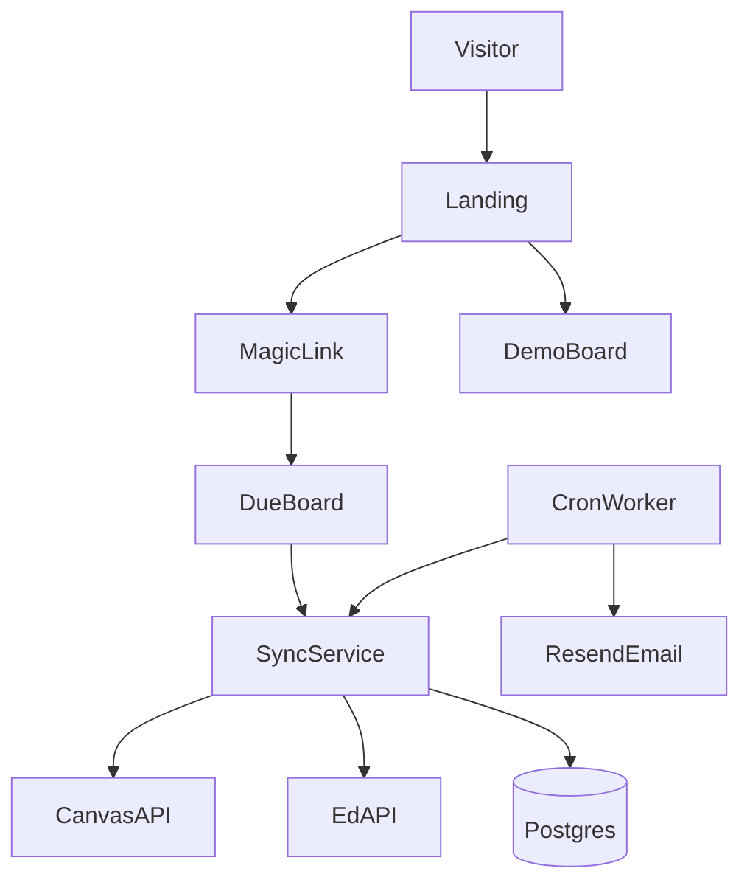

# DueBoard

**Multi-tenant, multi-institution web app that syncs Canvas + Ed LMS deadlines, encrypts per-user API tokens, and sends timezone-aware email digests (defaults to `Australia/Sydney`).**

> Formerly **Usyd Due** (University of Sydney focused). Now institution-agnostic — pick your school and the correct Canvas / Ed URLs are pre-filled.


Live demo (after you deploy): set `BASE_URL` in Render and link it here. Locally: [http://127.0.0.1:8000](http://127.0.0.1:8000) → **Try demo**.

**Deploy to Render (free `*.onrender.com`, no custom domain):** step-by-step in Chinese — [docs/DEPLOY_RENDER.md](docs/DEPLOY_RENDER.md).

Not affiliated with any listed university.

## Problem

Students juggle Canvas assignments and Ed lessons with different UIs and due rules. Laptop-only notifiers do not help classmates. Tokens must never live in frontend JS.

## Features

- **Multi-institution support** — USYD, UNSW, Unimelb, Monash, ANU, UQ, and a Custom preset out of the box
- Magic-link sign-in (email)
- Encrypted Canvas / Ed token storage (Fernet)
- Due board: course, title, deadline, remaining time, source, deep link
- Filters: skip Drills, Canvas `submission_types: none` placeholders, already submitted work
- Morning / evening email digests (configurable hours)
- Public **Try demo** path with fictional dues (no LMS credentials)
- Shared domain library [`dues_lib/`](dues_lib/) reused by the web worker and optional local macOS tool

## Architecture



| Piece | Role |
|-------|------|
| `web/` | FastAPI + Jinja UI, auth, settings, board |
| `dues_lib/` | Fetch + filter + `DueItem` model |
| `web/worker.py` | Scheduled sync + digests |
| `remind.py` | Optional personal macOS notifier |

## Stack

Python 3.12 · FastAPI · SQLAlchemy · Postgres (prod) / SQLite (dev) · Fernet · Resend/SMTP · Render

## Security

- Tokens encrypted at rest; never echoed after save
- Per-user row isolation (board only loads `user_id`)
- Demo account is read-only for settings
- Official APIs only — no login-page scraping
- See [/privacy](web/templates/privacy.html) in the running app

**Revoke:** delete the token in Canvas / Ed, then clear it under Settings.

## Demo

Landing → **Try demo** signs you in as `demo@due-board.local` with seeded fictional dues. Recruiters can explore the board without LMS accounts.

## Local development

```sh
cp .env.example .env
uv sync --extra dev
uv run due-board-web
# another terminal — optional worker
uv run due-board-worker
uv run pytest -q
```

Without `RESEND_API_KEY` / SMTP, magic links print on the login page and in the console.

## Deploy (Render)

1. Create a [Resend](https://resend.com) API key and verified `from` address.
2. Generate Fernet key: `python -c 'from cryptography.fernet import Fernet; print(Fernet.generate_key().decode())'`
3. Blueprint: connect the repo and apply [`render.yaml`](render.yaml) (web + worker + Postgres).
4. Set env: `BASE_URL=https://<service>.onrender.com`, `TOKEN_FERNET_KEY`, `RESEND_API_KEY`, `SMTP_FROM`, `REQUIRE_MAIL=true`.
5. Health check: `/healthz`. Worker command: `due-board-worker` (run every 10–15 minutes or as a background worker loop via cron).

`postgres://` URLs from Render are normalized to `postgresql+psycopg://`.

Docker: `Dockerfile` installs `.[postgres]`.

## Resume bullets

See [docs/RESUME_BLURB.md](docs/RESUME_BLURB.md). Screenshot checklist: [docs/SCREENSHOTS.md](docs/SCREENSHOTS.md).

## Optional: local macOS notifier

Personal backup only — classmates use the website.

```sh
./install-notifier.sh && ./install-launchd.sh
uv run due-board --dry-run --mode summary
```
